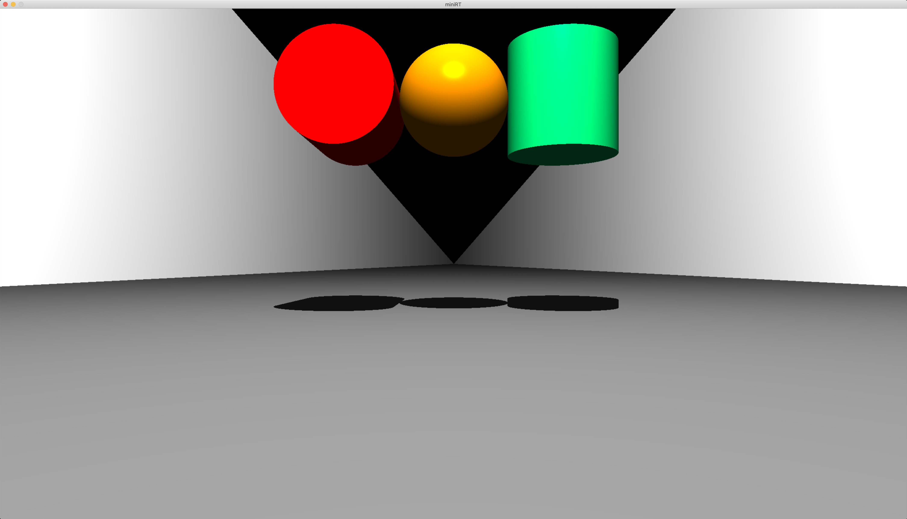
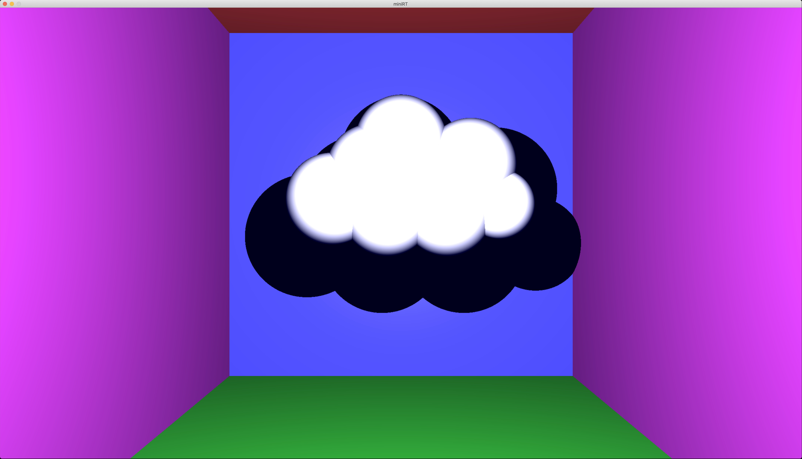
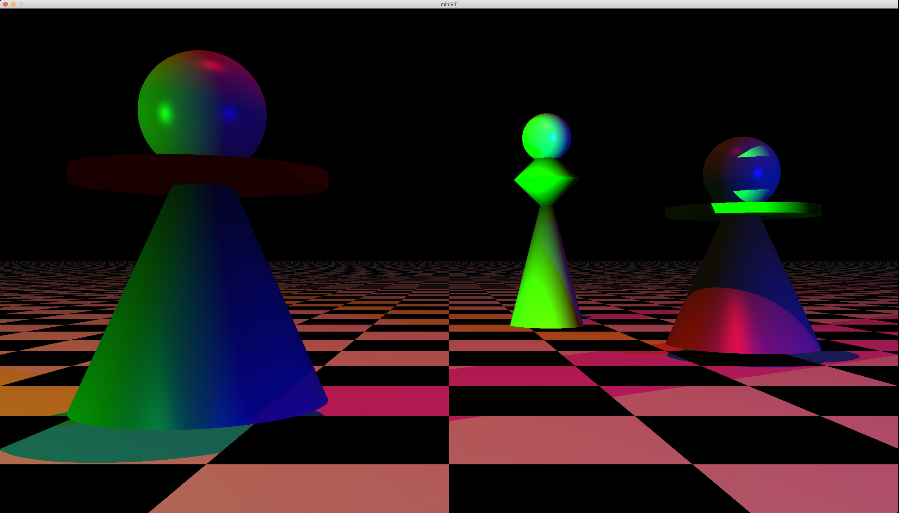

# miniRT







## 소개
miniRT는 레이 트레이싱 기술을 사용하여 컴퓨터로 생성된 이미지를 렌더링하는 프로젝트입니다.

## 주요 기능
- 기본적인 레이 트레이싱 기능 구현을 통해, 간단한 3D 이미지 렌더링
- 사용자 인터페이스는 miniLibX 라이브러리를 사용하여 구현
- 프로그램 종료는 ESC 키 입력 또는 윈도우 닫기 버튼 클릭

## 설치 및 실행 방법
GitHub에서 소스 코드를 클론한 후, 다음 명령어를 통해 프로그램을 컴파일하고 실행할 수 있습니다.

```bash
git clone https://github.com/hleesa/miniRT.git
```
```bash
cd miniRT
make bouns
./miniRT data/chess_bonus.rt
```

## 프로그램 설명
프로그램은 다음의 기능을 구현해야 합니다:
- miniLibX 사용
- 윈도우 관리는 유동적이어야 합니다: 다른 윈도우로 전환, 최소화 등이 원활해야 합니다.
- 윈도우 해상도 변경 시, 윈도우 내용은 그대로 유지되며 적절히 조정되어야 합니다.
- 최소 세 가지 간단한 기하학적 객체를 구현해야 합니다: 평면(plane), 구(sphere), 원통(cylinder).

## 장면 설명 파일
프로그램은 첫 번째 인자로 장면 설명 파일(.rt 확장자)을 받습니다. 각 장면 요소는 엄격한 순서에 따라 정보를 포함해야 하며, 파일 내에서 어떠한 요소도 잘못 설정되면 프로그램은 적절하게 종료되어야 합니다.

## Made by...

[salee2](https://github.com/hleesa)

[gychoi](https://github.com/sideseal)
